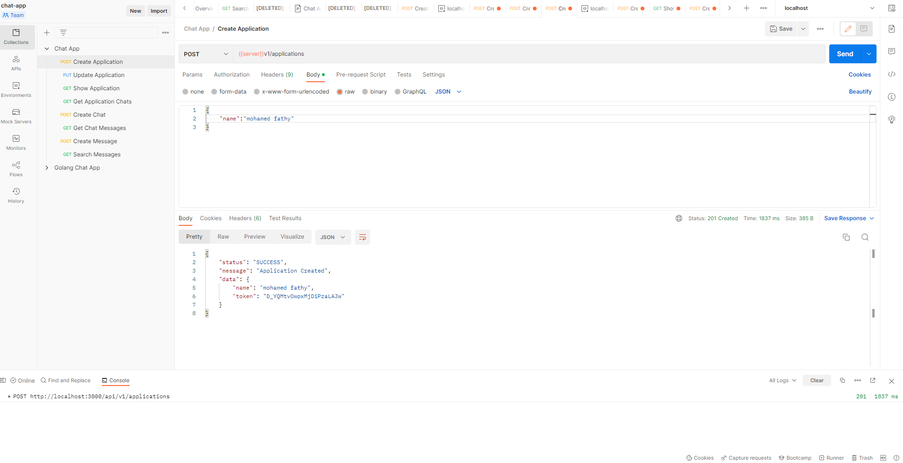

# README

This README would normally document whatever steps are necessary to get the
application up and running.

## Installing !

### 1- (First Way) By Using Docker & Docker Compose

Prerequisites :
* you must have Docker installed (running) on your machine & Docker compose


To start up the application in your local Docker environment:

```bash
git clone https://github.com/EngMohamedFathy/rails-chat-app.git
cd rails-chat-app
docker-compose up
```

Wait some minutes while building. Then,
navigate your API client program as Postman Or other tool 

`http://[DOCKER_HOST]:[DOCKER_PORT]`

`http://localhost:3001` (3001) this port number that used in docker-compose.yml file, you can change it

Postman Collection Shared, Click [here](https://documenter.getpostman.com/view/14343417/2s83zgu52y) to go to the collection.


Notes :
* database will be created from migration in mysql container with name: `chat-app-dev` `chat-app-test`

Enjoy!

### 2- (Second Way) Install Direct on you Machine

Prerequisites (you must have all these) :
* ruby '2.6.10'
* rails v5
* mysql
* elasticsearch
* redis


To start up the application in your local Docker environment:

```bash
git clone https://github.com/EngMohamedFathy/rails-chat-app.git
cd rails-chat-app
rails db:craete
rails db:migrate
rails server
```

Wait some minutes while building. Then,
navigate your API client program as Postman Or other tool

`http://localhost:3000` (3000) default port for rails app

Postman Collection Shared, Click [here](https://documenter.getpostman.com/view/14343417/2s83zgu52y) to go to the collection.


Notes :
* database will be created from migration in mysql DBMS: `chat-app-dev` `chat-app-test`


## Running !
use your prefer api client app (for me Postman) and consume all api
Postman Collection Shared, Click [here](https://documenter.getpostman.com/view/14343417/2s83zgu52y) to go to the collection.

base URL for API
``http://localhost:3001/api/v1/``



Thanks :)

Enjoy!